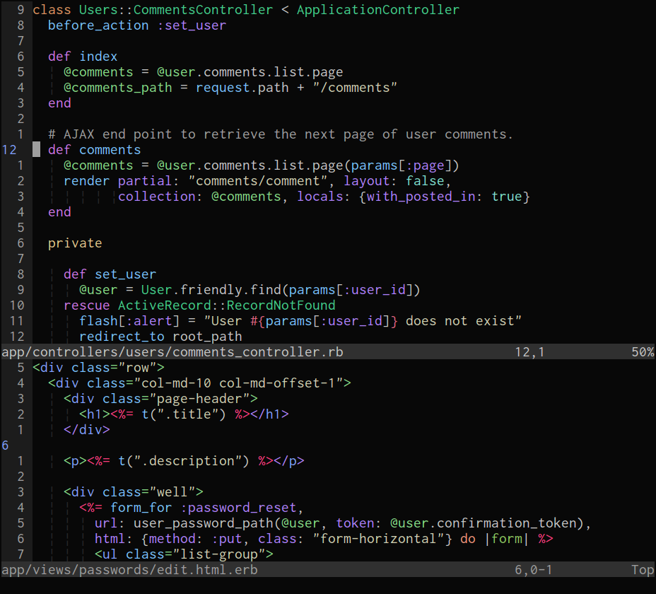
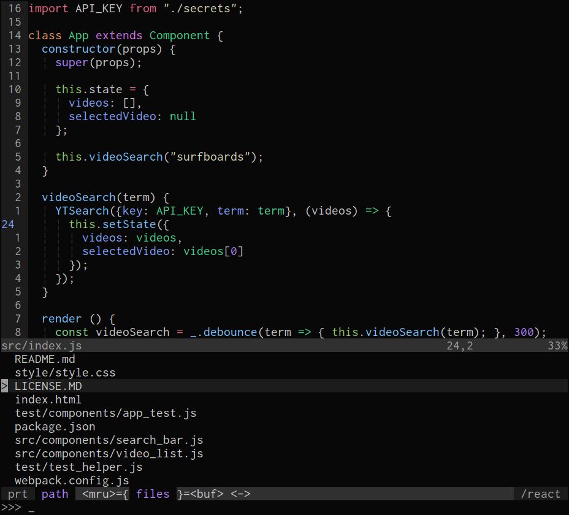

moonfly
=======

*moonfly* is a dark color scheme for Vim and Neovim that has taken inspiration
from:

* [sunburst](http://colorsublime.com/theme/Sunburst)
* [xoria256](https://github.com/vim-scripts/xoria256.vim)
* [One Dark](https://github.com/atom/one-dark-syntax)
* [One](https://github.com/rakr/vim-one)
* [monokai](https://atom.io/themes/monokai)

Note, the *moonfly* color scheme does incrementally change from time to time,
primarily in regards to language and plugin theming. However, the core color
palette will not change; **except** the time I changed crimson (July 1 2017),
sorry.

A simple companion statusline,
[vim-moonfly-statuline](https://github.com/bluz71/vim-moonfly-statusline), is
also available.

Screenshots
-----------

#### Ruby


#### JavaScript



Languages explicitly styled
---------------------------

* C/C++
* Shell
* Python
* Ruby
* Crystal
* Elixir
* JavaScript/ES6
* CoffeeScript
* Markdown
* Go
* Rust
* Java

Plugins explicity styled
------------------------

* NERDTree
* Tagbar
* Neomake
* CtrlP
* clever-f
* BufExplorer

Installation
------------

Use your favoured plugin manager to install **bluz71/vim-moonfly-colors** then
set the colorscheme in your *vimrc* file.

If using [vim-plug](https://github.com/junegunn/vim-plug) do the following:

1. Add `Plug 'bluz71/vim-moonfly-colors'` to your *vimrc*
2. Run `:PlugInstall`
3. Add `colorscheme moonfly` to your *vimrc*, make sure this line appears
   **after** the *Plug* declaration.

Options
-------

The `g:moonflyCursorLineNr` option specifies whether to highlight the cursor
line, as blue, in the number column if the `relativenumber` or `cursorline`
settings are in effect. By default the cursor line will be highlighted as such.

To disable highlighting of the current cursor line in the number column please
add the following to your *vimrc*:

```
let g:moonflyCursorLineNr = 0
```

The `g:moonflySpellInverse` option specifies whether to highlight spelling
errors in bold reversed colors. By default spelling errors will be highlighted
using colored undercurls. However, most (all?) terminals do not appear to
support *undercurls* let alone colored *undercurls*, simple underlines are
usually displayed. Note, GUI-based Vim's, such as *gVim* and *Macvim*, do
correctly display colored undercurls.

To highlight spelling errors in bold inverse colors please add the following to
your *vimrc*:

```
let g:moonflySpellInverse = 1
```

The `g:moonflyCursorColor` option specifies whether to color the cursor or not.
By default the cursor will **NOT** be colored, if you prefer a colored cursor
then add the following to your *vimrc*:

```
let g:moonflyCursorColor = 1
```

The `g:moonflyTerminalColors` option specifies whether to use the moonfly color
palette in `:terminal` windows when `termguicolors` is set. By default this
option is disabled, if you prefer to use the moonfly color palette for the
first 16 colors then add the following to your *vimrc*:

```
let g:moonflyTerminalColors = 1
```

True Color Terminals
--------------------

Many terminal programs, such as [iTerm2](http://www.iterm2.com) and
[termite](https://github.com/thestinger/termite), support
[24-bit true colors](https://gist.github.com/XVilka/8346728). Modern versions
of Vim and Neovim, on such terminals, support true colors when `set
termguicolors` is enabled.

Caveat, *Terminal.app* on macOS and *xterm* on Unix do **not** support true
colors.

On terminals that do support true colors, and when `termguicolors` is set,
the *moonfly* color scheme will not require any terminal configuration to emit
the correct *moonfly* colors.

For the true colors *moonfly* color scheme to display correctly inside *tmux*
the following setting will be required in *~/.tmux.conf*:

```
set -ga terminal-overrides ',xterm-256color:Tc'
```

Vim, as against Neovim, inside *tmux*, will also require the following setting
be added to *vimrc:*

```viml
set t_8b=^[[48;2;%lu;%lu;%lum
set t_8f=^[[38;2;%lu;%lu;%lum
```

Note: `^[` in the above snippet is a real escape character; to insert it,
enter `Ctrl-v` followed by `Esc`. Repeating, the above `t_8*` settings are
**not** required for Neovim.

If consistency between Vim colors and `$SHELL` colors is important then I
recommend proceeding with the 256-color configurations listed in the next
section.

256 Color Terminals
-------------------

The *moonfly* Vim color scheme when used with Vim in a 256-color terminal
**requires** the host terminal be setup with the *moonfly* color palette.

The host terminal must be configured for 256 colors, this usually means setting
the terminal's type to **xterm-256color** or **screen-256color** when used
inside [tmux](https://tmux.github.io/).

*iterm2* users on macOS can import [this](moonfly.itermcolors) color scheme.

*xterm* users on Linux can add the following snippet to their *~/.Xresources*
file and launch xterm with `xterm -name xterm-moonfly`. A complete
*Xresources* file is available
[here](https://github.com/bluz71/dotfiles/blob/master/Xresources)

```
xterm-moonfly*background:  #080808
xterm-moonfly*foreground:  #b2b2b2
xterm-moonfly*color0:      #373c40
xterm-moonfly*color1:      #ff5454
xterm-moonfly*color2:      #8cc85f
xterm-moonfly*color3:      #e3c78a
xterm-moonfly*color4:      #80a0ff
xterm-moonfly*color5:      #ce76e8
xterm-moonfly*color6:      #7ee0ce
xterm-moonfly*color7:      #de935f
xterm-moonfly*color8:      #f09479
xterm-moonfly*color9:      #f74782
xterm-moonfly*color10:     #42cf89
xterm-moonfly*color11:     #cfcfb0
xterm-moonfly*color12:     #78c2ff
xterm-moonfly*color13:     #ae81ff
xterm-moonfly*color14:     #85dc85
xterm-moonfly*color15:     #e2637f
```

Other terminals should be setup with the following color configuration:

* background `080808`
* foreground `b2b2b2`
* color0  / Palette 1  / Black:        `#373c40`
* color1  / Palette 2  / Red:          `#ff5454`
* color2  / Palette 3  / Green:        `#8cc85f`
* color3  / Palette 4  / Yellow:       `#e3c78a`
* color4  / Palette 5  / Blue:         `#80a0ff`
* color5  / Palette 6  / Magenta:      `#ce76e8`
* color6  / Palette 7  / Cyan:         `#7ee0ce`
* color7  / Palette 8  / White:        `#de935f`
* color8  / Palette 9  / Bold Black:   `#f09479`
* color9  / Palette 10 / Bold Red:     `#f74782`
* color10 / Palette 11 / Bold Green:   `#42cf89`
* color11 / Palette 12 / Bold Yellow:  `#cfcfb0`
* color12 / Palette 13 / Bold Blue:    `#78c2ff`
* color13 / Palette 14 / Bold Magenta: `#ae81ff`
* color14 / Palette 15 / Bold Cyan:    `#85dc85`
* color15 / Palette 16 / Bold White:   `#e2637f`

License
-------

[MIT](https://opensource.org/licenses/MIT)
